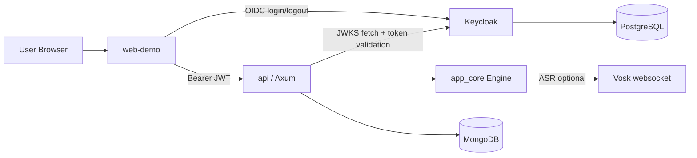

# Architecture

## 1. System Overview
The project is split into a Rust backend core (`app_core` + `api`) and a web client (`web-demo`) with Keycloak-based authentication.

Runtime services in the local stack:
- `web-demo` (Vite/React frontend)
- `api` (Rust HTTP service, Axum)
- `mongodb` (primary application persistence)
- `postgres` (Keycloak database)
- `keycloak` (OIDC provider)
- `vosk` (ASR websocket service, optional in analysis path)

## 2. Implemented Runtime Architecture (Current)

Notes:
- API validates JWT issuer/audience via Keycloak JWKS.
- Analysis pipeline is orchestrated by `app_core::Engine`.
- MongoDB stores user profile/session/challenge/artifact state.

## 3. Backend Internal Layers
`api` crate is layered as:
1. Routes/controllers (`api/src/routes/*`)
2. Auth middleware + request validation
3. Orchestration (`app_core::Engine`, provider adapters)
4. Repository interfaces + Mongo implementations
5. Persistence (Mongo collections + indexes)

## 4. Main Request Flows
### 4.1 Authenticated API flow
1. Frontend gets token from Keycloak.
2. Frontend calls API with `Authorization: Bearer ...`.
3. API middleware validates token signature and claims.
4. Route handler executes business logic and repository calls.

### 4.2 Analyze pipeline (`POST /api/analyze`)
1. Route validates payload/body size.
2. Engine extracts/uses signal features, runs prosody + voice presentation tools.
3. Optional ASR/pronunciation enrichment is applied.
4. LLM coach feedback is generated (provider/fallback based on config).
5. Artifact is persisted and response returned.

### 4.3 Challenge/session flow
1. Frontend reads/writes daily challenge and sessions through API routes.
2. API enforces challenge state validation and streak updates.
3. Data is stored per authenticated user in MongoDB.

## 5. Deployment Topologies
### Local demo topology (implemented)
- `docker-compose.yml` services with direct port exposure:
  - frontend: `5173`
  - api variants: `3000/3001/3002`
  - keycloak: `8080`
  - vosk: `2700`

### Target edge topology (recommended)
- Firewall -> Reverse Proxy -> API/Auth services
- TLS termination and security headers at edge
- Rate limiting and request-size guards at edge + API

## 6. Current vs Target
- **Implemented now:** single-host Docker Compose stack for demo/development.
- **Target (thesis direction):** clearer edge layer and potentially separate gateway concerns, while keeping Rust backend core and pluggable analysis providers.
