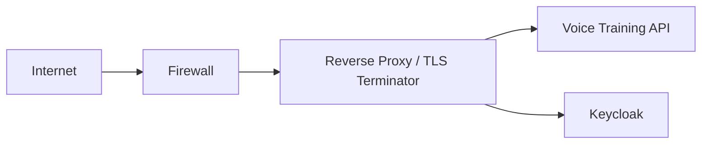

# Edge and Network Architecture

## Current State
The local stack does not run a dedicated edge proxy/LB service in `docker-compose.yml`.
Services are exposed directly on host ports for demo and development.

## Recommended Edge Topology

Recommended responsibilities:
- Firewall: inbound allow-list and port minimization.
- Reverse proxy:
  - TLS termination
  - security headers
  - request size/rate limits
  - access logging and upstream health checks

## Auth and Redirect Constraints
Keycloak + frontend require exact redirect/logout URI alignment:
- login redirect URIs for frontend base URL(s)
- post-logout redirect URIs for frontend base URL(s)
- issuer and audience settings aligned with API validation config

## CORS and Body Limits
- CORS policy should allow only trusted frontend origins.
- Body limits should be enforced both at edge and API (`ANALYZE_MAX_BODY_BYTES`).

## Practical Demo Guidance
For the thesis demo, you can present:
- implemented direct-port local topology
- recommended production edge topology above
and explicitly mark proxy/LB as architectural next step.
